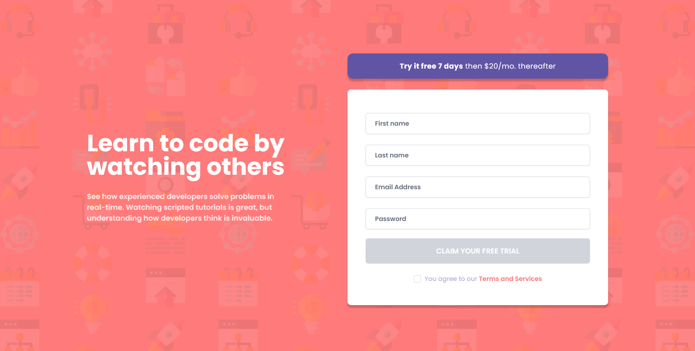
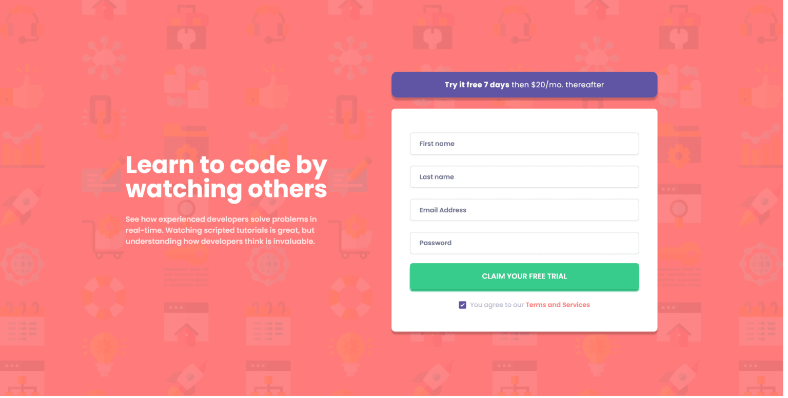
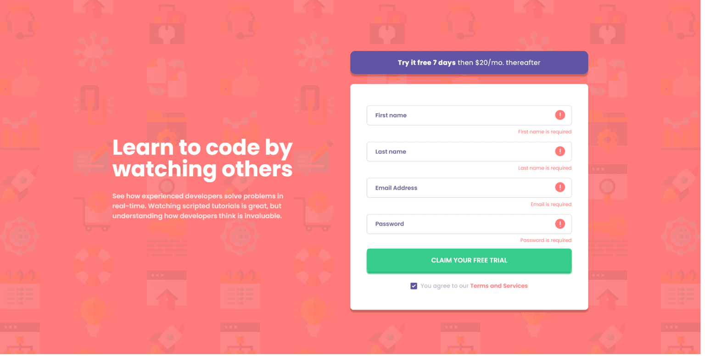

# Frontend Mentor - Intro component with sign up form

This is a solution to the [following challenge](https://www.frontendmentor.io/challenges/intro-component-with-signup-form-5cf91bd49edda32581d28fd1)

## Table of contents

- [Overview](#overview)
  - [The challenge](#the-challenge)
  - [Screenshots](#screenshots)
  - [Links](#links)
- [My process](#my-process)
  - [Built with](#technologies-used)
  - [What I learned](#what-i-learned)
  - [Continued development](#continued-development)
  - [Useful resources](#useful-resources)
- [Author](#author)
- [Acknowledgments](#acknowledgments)

## Overview

### The challenge

Users should be able to:

- View the optimal layout for the site depending on their device's screen size
- See hover states for all interactive elements on the page
- Receive an error message when the `form` is submitted if:
  - Any `input` field is empty.
  - The email address is not formatted correctly (i.e. a correct email address should have this structure: `name@host.tld`).
  - Password is less than 8 characters
  - I added a bonus checkbox for _T&C_. Form will not submit without checking this box first.

### Screenshots

#### Desktop

#### Mobile

  

  

### Links

- Solution URL: [Github](https://github.com/killer-goose/Signup-Component)
- Live Site URL: [Deployment](https://gentle-froyo-74b6f1.netlify.app/)

## My process

- Created a figma file out of images
- Designed my markup desktop-first
- Added CSS mobile-first
- Refactored, documented and all over again
- Tracked my time throughout

### Technologies used

- **[React](https://react.dev/)** - for composable spaghetti code
- **[Typescript](https://www.typescriptlang.org/)** - type safety at the cost of headache
- **[Tailwindcss](https://tailwindcss.com/)** - for ugly HTML
- **[Tailwind/forms](https://github.com/tailwindlabs/tailwindcss-forms)** - for resets
- **[React hook form](https://react-hook-form.com/)** - form states, performance, errors
- **[Zod](https://zod.dev/)** - schema resolver, form validator
- **[Prettier](https://prettier.io/)** - tabs or spaces? pnpm format
- **[pnpm](https://pnpm.io/)** - low disk space? say no more

### What I learned

- Documenting your code.
- Type-safety is underrated.
- Zod as a schema resolver makes the code a little more structured.
- Making projects and refining them on your own without deadlines is bliss.

### Continued development

This project is close to complete.

Continued development will primarily involve code refactoring.

### Useful resources

- [Bytegrad](https://youtu.be/AeQ3f4zmSMs) - The why and how of zod: the schema validation library

- [Rhf documentation](https://react-hook-form.com/) is top notch. Kudos to the team

- [Vite docs](https://vitejs.dev/guide/build.html) - There's more to your quiet and efficient build tool

- [Avoid spaghetti code](https://youtu.be/dQw4w9WgXcQ) - #1 resource for best practices

## Author

- Frontend Mentor - [killer-goose](https://www.frontendmentor.io/profile/killer-goose)
- Mastodon - [@mymind_is_a_mush](https://mastodon.social/@mymind_is_a_mush)

## Acknowledgments

[Bytegrad](https://www.youtube.com/@ByteGrad)- This guy makes absolute high quality content. I owe all my inspiration to work on a form based project to him.

[Frontend mentor](https://www.frontendmentor.io/home) - Much thanks to provide me with a simple yet beautiful design that can engage me to the very end.
